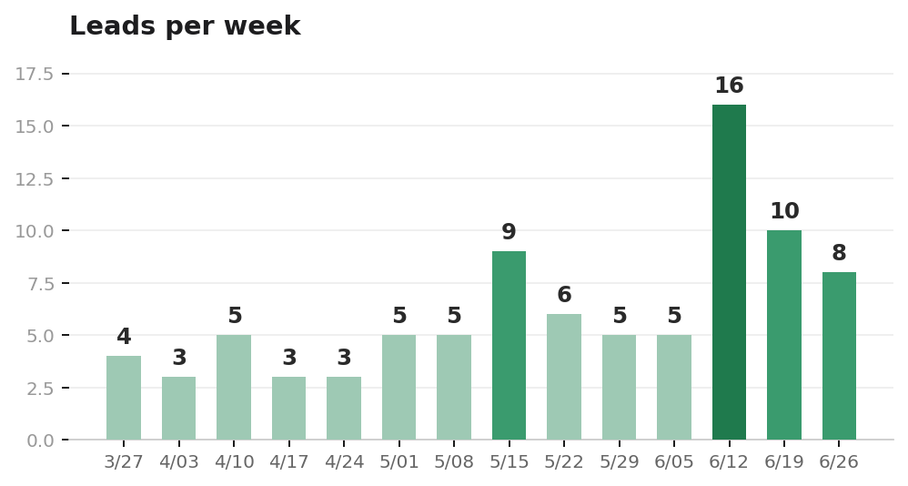
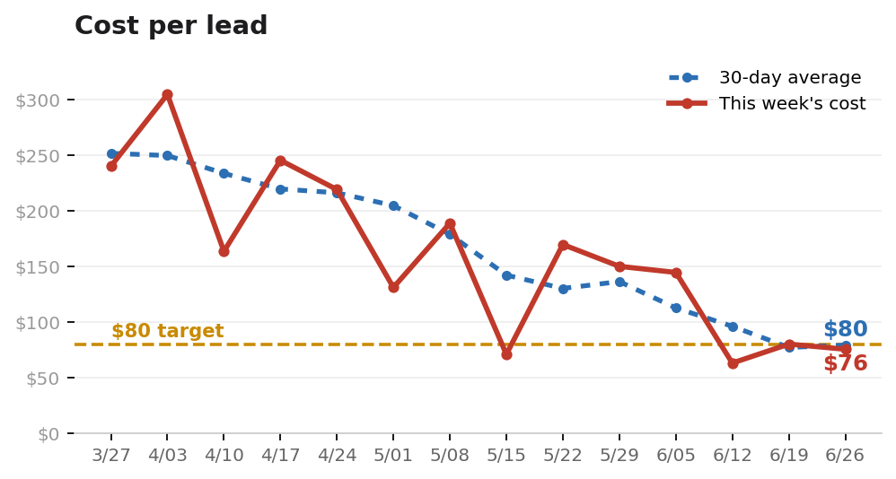

<!-- Anonymized example output from google-ads-client-view, the real production render of SummitDumpster_MAA_2026-06-26.md. Charts by render_charts.py from trend.csv. -->

# Summit Dumpster Rental, Weekly Google Ads Report

**🟢 On track** · Week of June 26, 2026

## The bottom line

> After a strong week last week, we held our performance. The rolling 30-day cost per lead is $79.55 across 43 leads, under your $80 target, and still a long way down from $234 per lead back in March. This week itself landed 8 leads at $75.89, comfortably under target on about $200 less spend than last week. One number to keep half an eye on: confirmed bookings cooled to 1 this week and 8 over 30 days, down from 5 and 12, as the strong early-month booking weeks aged out of the window.

## 📊 The trend, last 13 weeks

## What's working ✅

- ✅ Rolling 30-day cost per lead is $79.55, under your $80 target and down from $234 in March.
- ✅ This week landed 8 leads at $75.89, under target on about $200 less spend than last week.
- ✅ The generic Dumpster Rental ad group booked 6 of the 8 leads at $36.80 each, the cleanest cost in the account right now.
- ✅ Quality Score is solid where it counts: on roll off dumpster, our highest-spend keyword, both Ad Relevance and the landing page are strong.

## What needs attention 🔴

- Nothing needs a decision from you this week. The account is under target and the open items are ours to manage.

## 👉 What we need from you this week

- Nothing this cycle. We are letting the account gather more data behind the improved Quality Score before making any change.

## What we did this week (no action needed)

- ✅ Held budget steady rather than scaling. Last week's budget pressure eased this week, so we are gathering more data behind the improved Quality Score before pushing spend.
- ✅ Gave the Concrete campaign's Maximize Clicks switch another week. If it is still not delivering next cycle, we will move it to Manual CPC to force delivery and get some data.
- ✅ Kept both Roll Off ads running (normal week-to-week rotation) and are letting the lagging Expected CTR season behind the improved relevance and landing page.
- ✅ Running the Round 12 negative keywords plus a Long-Term ad-group negative on "commercial dumpster service" to stop a cross-intent leak.

---

## Full analysis (for the detail-minded)

**Metrics**

**Brightwater Dumpster Rentals (Search | Maximize Conversions)**

- **Cost**: $607.09
- **Impressions**: 873
- **Clicks**: 57
- **CTR**: 6.53%
- **CPC**: $10.65
- **Conversions**: 8 (4 click-to-call, 2 Smart Campaign calls, 1 confirmed booking, 1 form fill)
- **CPA**: $75.89

**Brightwater Concrete Dumpsters (Search | Maximize Clicks)**

- **Cost**: $0.00 (7D)
- **Impressions**: 0 (7D)
- **Clicks**: 0 (7D)
- **Conversions**: 0
- **CPA**: N/A. We moved Concrete to Maximize Clicks this week, and it drew zero impressions in its first 7 days. The 30-day totals ($108.75 / 160 impressions) are stale carryover from earlier in June under the old strategy, unchanged for three weeks, not new activity.

The win this week was the generic Dumpster Rental ad group, which booked 6 of the 8 leads at $36.80 each, the cleanest cost in the account right now and the main reason cost per lead improved even on lighter spend. The account runs a balanced set of keywords, and which group leads tends to rotate week to week, so this reads as a strong week from one of them, not a shift to chase. Roll Off was quieter this week, and nothing in the numbers calls for a change there.

The budget case softened this week, and I want to be straight about it. Last week the entire argument for more budget rested on losing 30.8% of impressions to budget. This week that number is zero, because spend came in about $200 lighter and the daily cap never bound; what we're missing now is to Ad Rank (28.3% of this week's impressions). On the 30-day view budget (20.9%) and rank (19.0%) are close to a tie. So the monthly case for scaling is still real, roughly a fifth of available auctions go unbought, but it's a 30-day-trend decision now. Feeding budget into a week where rank, not budget, is the limiter would just buy deeper into lower-rank auctions instead of capturing impressions we're actually priced out of by budget.

Quality Score is in good shape where it counts. On roll off dumpster, our highest-spend keyword at $938 over 30 days, both Ad Relevance and the landing page are solid (Quality Score 5). The only soft component is Expected CTR, which is a lagging signal that trails the others; with relevance and the landing page now in good standing, we'd expect it to come up on its own over the next few weeks, so we're giving it time rather than chasing it with copy changes. open top dumpster rental (QS 6) sits the same way, with its real issue simply being that it hasn't converted on its own intent yet.

Concrete moved to Maximize Clicks this week and hasn't budged yet. The switch is meant to force its keywords into auctions, but in its first seven days it drew zero impressions, so there's no delivery to read. The 30-day numbers (160 impressions, $108.75) are stale carryover from earlier in June under the old strategy, not new activity. Too early to judge after one week, but there's no sign of recovery yet, so it stays a close watch for next cycle. The weakest segment overall stays Long-Term & Open Top, your priority growth lane: its only lead this week leaked in from a generic query (dumpster rentals brightwater, $24.58), not long-term or open-top intent, so the segment still isn't turning on by itself. Waste was low, mostly legitimate in-area generics that didn't close (dumpster rental brightwater $62.63, rent a dumpster $31.50); the one routing leak worth a negative is commercial dumpster service ($28.19, 0 leads) matching into the Long-Term group.

**Action**

1. **Budget lift, reframed as a 30-day call and more data needed.** Last week's urgent budget signal collapsed to 0% this week as spend ran lighter, so this isn't a this-week emergency anymore. The 30-day picture still shows about a fifth of impressions lost to budget against a near-equal rank loss, so the case to scale holds on the month. For now we will let this run as is so we can get more data with the improved Quality Score elements before we dig in.
2. **Concrete ad group, give the Maximize Clicks switch another week.** It went live this week and drew zero impressions in its first seven days, so there's nothing to read yet. Our side: if it's still not delivering next cycle, we will bump to manual CPC to force delivery and get some data.
3. **Roll Off ad group, keep both ads running.** Which keyword or ad leads rotates week to week in a balanced account, so the quieter week here isn't something to act on, and Quality Score is healthy with only the lagging Expected CTR component to let season. Our side: run the Round 12 negatives plus a Long-Term ad-group negative on commercial dumpster service.
